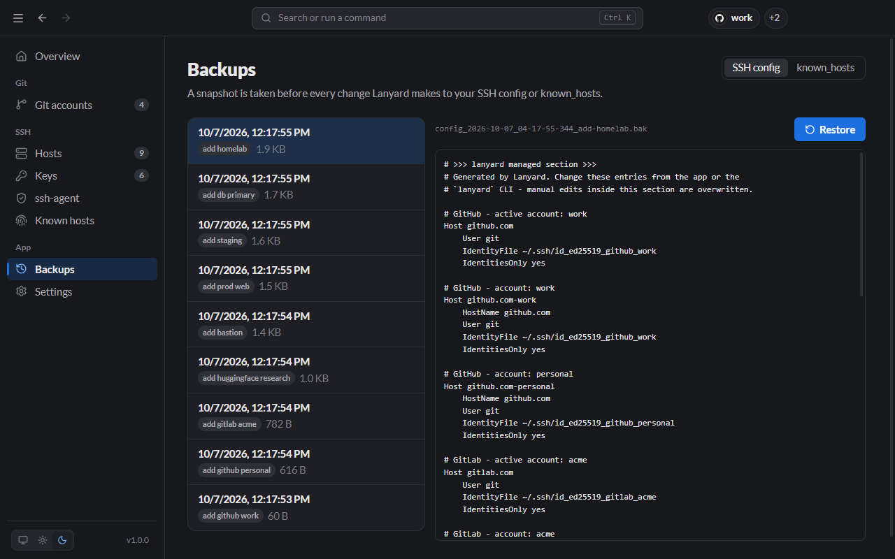

# Backups

Before every change Lanyard makes to `~/.ssh/config` or `~/.ssh/known_hosts`, it saves a copy of the file. The **Backups** page lists them, newest first, with what caused each one.



## Restore a backup

1. Pick **SSH config** or **known_hosts** at the top.
2. Select a backup on the left. Its contents appear on the right.
3. Click **Restore**.

Restoring is itself backed up, so you can undo a restore the same way.

From the CLI:

```bash
lanyard backups list
lanyard backups show <id>
lanyard backups restore <id>
```

## Where backups are kept

In `~/.lanyard/backups`, as plain text files named after the file, the time and the change, for example `config_2026-10-07_04-17-55-344_add-homelab.bak`.

Lanyard keeps the 30 most recent backups of each file. Change the number in [Settings](Settings.md) → **Backups to keep**.
