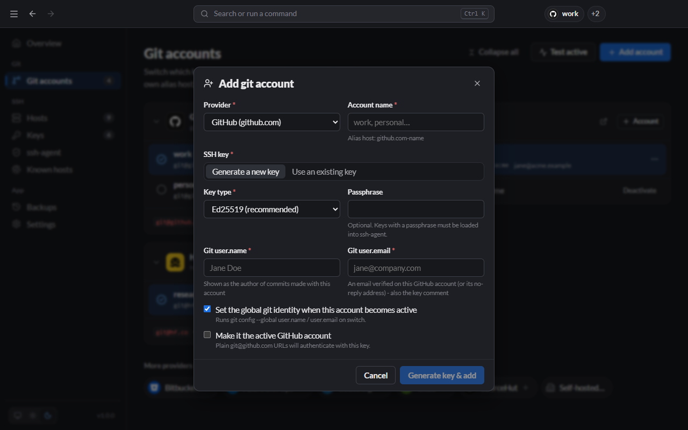

# Getting started

This walkthrough takes you from a fresh install to pushing with the right account. It takes about 5 minutes per account.

## 1. Add your first account

Open Lanyard and click **Add account** (or press <kbd>Ctrl</kbd>/<kbd>⌘</kbd>+<kbd>N</kbd>).



Fill in:

| Field              | What to enter                                                                                                 |
| ------------------ | ------------------------------------------------------------------------------------------------------------- |
| **Provider**       | Where the account lives, e.g. GitHub.                                                                         |
| **Account name**   | A short label you choose: `work`, `personal`, `client-acme`. Letters, digits, `.`, `_` and `-`.               |
| **SSH key**        | Keep **Generate a new key** for a fresh key, or pick **Use an existing key** if this account already has one. |
| **Key type**       | Ed25519 unless the provider needs something else.                                                             |
| **Passphrase**     | Optional. A passphrase protects the key file; you then load it into the [ssh-agent](SSH-Agent.md).            |
| **Git user.name**  | The name on your commits, e.g. `Jane Doe`.                                                                    |
| **Git user.email** | An email verified on this account, or its no-reply address. It is also the key's comment.                     |

Leave **Set the global git identity when this account becomes active** on if you want your commits signed with this account's name and email whenever it is active.

Click **Generate key & add**.

## 2. Register the public key with the provider

Lanyard shows the new public key.

1. Click **Copy public key**.
2. Click **Open GitHub key settings** (the button names your provider). On GitHub this is **Settings → SSH and GPG keys**.
3. Add a new SSH key, paste, and save.

## 3. Test it

Back in Lanyard, click **Test connection** in the same dialog (or **Test** on the account's card on the Overview page). You should see:

> Authenticated as your-username

If you see `Permission denied`, the key is not registered yet or was pasted into a different account. See [Troubleshooting](Troubleshooting.md#permission-denied-publickey).

## 4. Use git as usual

The active account now answers for plain URLs:

```bash
git clone git@github.com:acme/app.git
cd app
git commit -m "First commit as the right person"
git push
```

## 5. Add a second account and switch

Repeat steps 1 to 3 for your other account (say `personal`). Then switch whenever you need to:

- **Overview page:** pick the account in the provider's **Signed in as** list.
- **Tray icon:** right-click → GitHub → personal.
- **Command palette:** <kbd>Ctrl</kbd>/<kbd>⌘</kbd>+<kbd>K</kbd>, type `personal`, press Enter.
- **Terminal:** `lanyard use github personal`.

Need both accounts at the same time, one per repository? See [Using two accounts side by side](Git-Accounts.md#using-two-accounts-side-by-side).

## 6. Add a server

Servers already in your `~/.ssh/config` are listed on the **Hosts** page. To add one:

1. Open **Hosts** and click **Add host**.
2. Enter an **Alias** (`prod-web`), the **HostName** (`203.0.113.10`), the **User**, and pick the **IdentityFile** key.
3. Click **Add host**, then open the new row's **⋯** menu → **Connect**.

A terminal opens with `ssh prod-web`. From then on, connect from the tray, the command palette, or `lanyard connect prod-web`. More in [Hosts](Hosts.md).

## Next

- Close the window: Lanyard keeps running in the [tray](Tray-and-Shortcuts.md).
- Learn the [command palette and shortcuts](Tray-and-Shortcuts.md).
