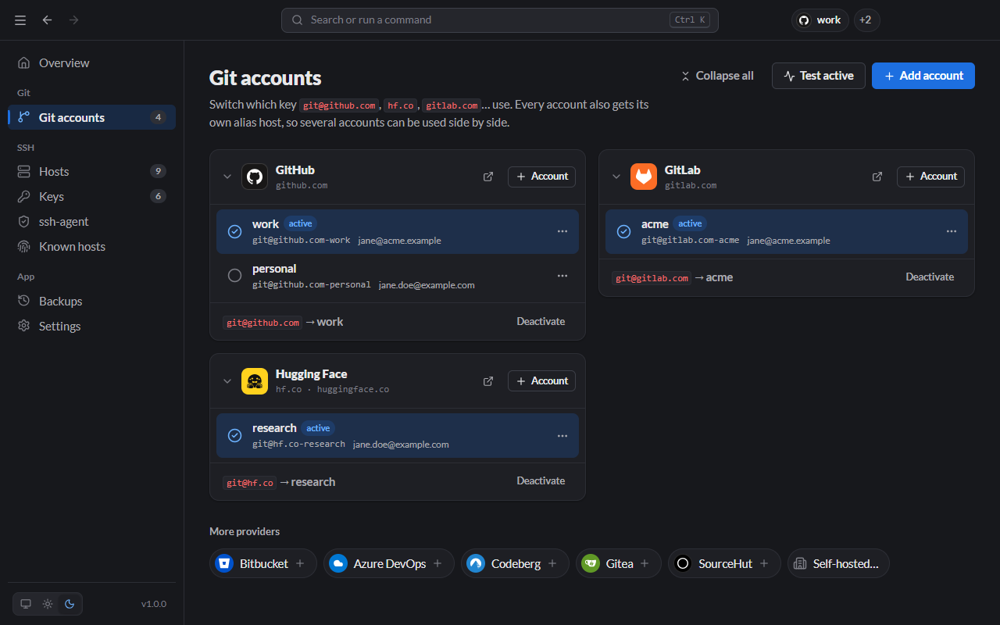

# Git accounts

The **Git accounts** page lists your accounts grouped by provider. Each provider has one **active** account: the one plain `git@github.com:…` URLs use.



## Add an account

Click **Add account** at the top, or **+ Account** on a provider's card. The dialog is described step by step in [Getting started](Getting-Started.md#1-add-your-first-account).

- **Generate a new key** creates `~/.ssh/id_<type>_<provider>_<account>`, for example `id_ed25519_github_work`. If that file already exists, Lanyard tells you and offers to use it or to pick a free name.
- **Use an existing key** lets you pick any key in `~/.ssh`, or browse for one elsewhere.

After adding, Lanyard shows the public key. Click **Copy public key**, then **Open … key settings** to paste it into the provider, and finally **Test connection**.

## Switch the active account

Any of these does the same thing:

- **Git accounts page:** click the circle next to the account.
- **Overview page:** pick the account under **Signed in as**.
- **Top bar:** the chips show who you are on each provider. Clicking one opens the command palette filtered to that provider's accounts.
- **Tray:** right-click the tray icon → provider → account.
- **Command palette:** <kbd>Ctrl</kbd>/<kbd>⌘</kbd>+<kbd>K</kbd> → type the account name.
- **CLI:** `lanyard use github personal`.

Switching rewrites the provider's block in the [managed section](How-It-Works.md) of `~/.ssh/config`. If the account has **Set the global git identity** turned on, Lanyard also runs `git config --global user.name` and `user.email` with the account's values.

**Deactivate** (at the bottom of a provider card) removes the active block. Plain URLs then fall back to SSH's default keys.

## Using two accounts side by side

Every account also gets its own **alias host**: `github.com-work`, `github.com-personal`, and so on. A URL that uses the alias always authenticates as that account, whichever account is active.

Clone with a specific account:

```bash
git clone git@github.com-personal:jane/dotfiles.git
```

Or let Lanyard rewrite the URL for you:

```bash
git clone $(lanyard url github personal https://github.com/jane/dotfiles)
```

Point an existing repository at an account (rewrites the `origin` remote and sets the repository's own `user.name` and `user.email`):

- **App:** account's **⋯** menu → **Clone / switch a repository**, then choose the folder.
- **CLI:** `lanyard repo github personal ./dotfiles`

## Test an account

**Test** runs `ssh -T` against the provider with the account's key and reads the reply:

| Result                                                   | Meaning                                                                                      |
| -------------------------------------------------------- | -------------------------------------------------------------------------------------------- |
| **Authenticated as `name`**                              | The key works and belongs to `name`.                                                         |
| **Permission denied**                                    | The key is not registered with this account, or it has a passphrase and is not in the agent. |
| **Connected, but the server did not recognise this key** | The server answered anonymously (Hugging Face does this for unknown keys).                   |
| **Host key verification failed**                         | The provider's host key in known_hosts doesn't match. See [Known hosts](Known-Hosts.md).     |

**Test active** at the top of the page tests every active account at once; so does `lanyard test`.

## Edit or remove an account

Open the account's **⋯** menu:

- **Edit:** rename it, change its key, its git name and email, or the global-identity switch.
- **Copy public key:** copies the `.pub` contents to paste into the provider.
- **Remove account:** removes it from Lanyard and from the managed section. You can also move its key to `~/.lanyard/trash`; keys still used by another account are kept.

## Self-hosted and other providers

Use the chips under **More providers** to add accounts on Bitbucket, Azure DevOps, Codeberg, Gitea or SourceHut. For your own server (self-hosted GitLab, Gitea, Forgejo, …) choose **Self-hosted…** and enter its **SSH hostname**. Set **SSH user** and **Port** if they aren't `git` and `22`, and optionally the **SSH keys page** URL so Lanyard can link to it.

From the CLI:

```bash
lanyard providers add work-gitlab --host git.company.com --name "Company GitLab"
lanyard accounts add work-gitlab jane --generate --git-name "Jane Doe" --git-email jane@company.com
```
