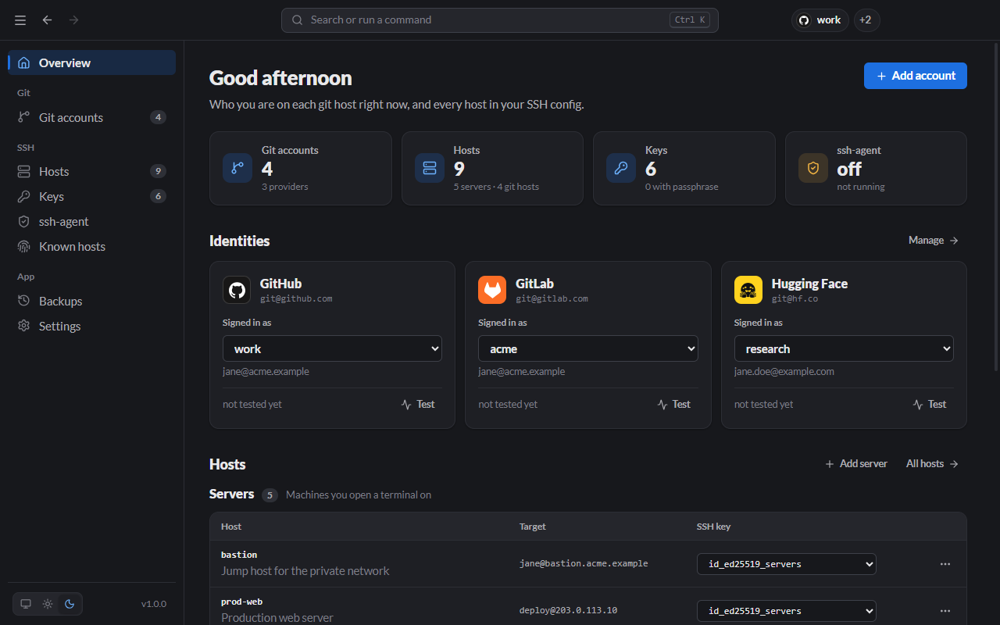

# Lanyard user guide

**Lanyard helps you wear the right identity everywhere.** It does two jobs:

- **Git accounts:** switch which GitHub, GitLab, Bitbucket or Hugging Face account your git commands use, in one click.
- **Remote SSH management:** keep every server you SSH into in one list; connect, switch each server's key, set up jump hosts and trust host keys safely.

Underneath, it keeps your SSH keys, ssh-agent and known_hosts in order. It runs as a desktop app, from the system tray, or as the `lanyard` command.

## Start here

1. [Installation](Installation.md): download and install, or get the CLI only.
2. [Getting started](Getting-Started.md): your first account, from download to `git push`, in about 5 minutes.

## Using the app

| Page                                                 | What it is for                                                                         |
| ---------------------------------------------------- | -------------------------------------------------------------------------------------- |
| [Git accounts](Git-Accounts.md)                      | Add accounts, switch between them, use two accounts side by side, clone as an account. |
| [Hosts (remote servers)](Hosts.md)                   | Every server you SSH into: add, edit, connect, switch its key, jump hosts.             |
| [Keys](Keys.md)                                      | Generate keys, copy public keys, passphrases, permissions.                             |
| [ssh-agent](SSH-Agent.md)                            | Load keys so you type a passphrase once.                                               |
| [Known hosts](Known-Hosts.md)                        | Check and trust server fingerprints; fix "host key changed".                           |
| [Backups](Backups.md)                                | Undo any change Lanyard made to your SSH files.                                        |
| [Settings](Settings.md)                              | Theme, accent colour, tray behaviour, terminal, files.                                 |
| [Tray, palette and shortcuts](Tray-and-Shortcuts.md) | Work without opening the window.                                                       |

## Reference

- [CLI reference](CLI-Reference.md): every `lanyard` command and option.
- [How it works](How-It-Works.md): what Lanyard writes to `~/.ssh/config`, and every file it touches.
- [Troubleshooting](Troubleshooting.md): `Permission denied (publickey)`, agent not running, host key changed, and more.

## Supported git providers

GitHub, GitLab, Bitbucket, Hugging Face, Azure DevOps, Codeberg, Gitea and SourceHut are built in. Add any other server, such as a self-hosted GitLab or Gitea, as a [custom provider](Git-Accounts.md#self-hosted-and-other-providers).
