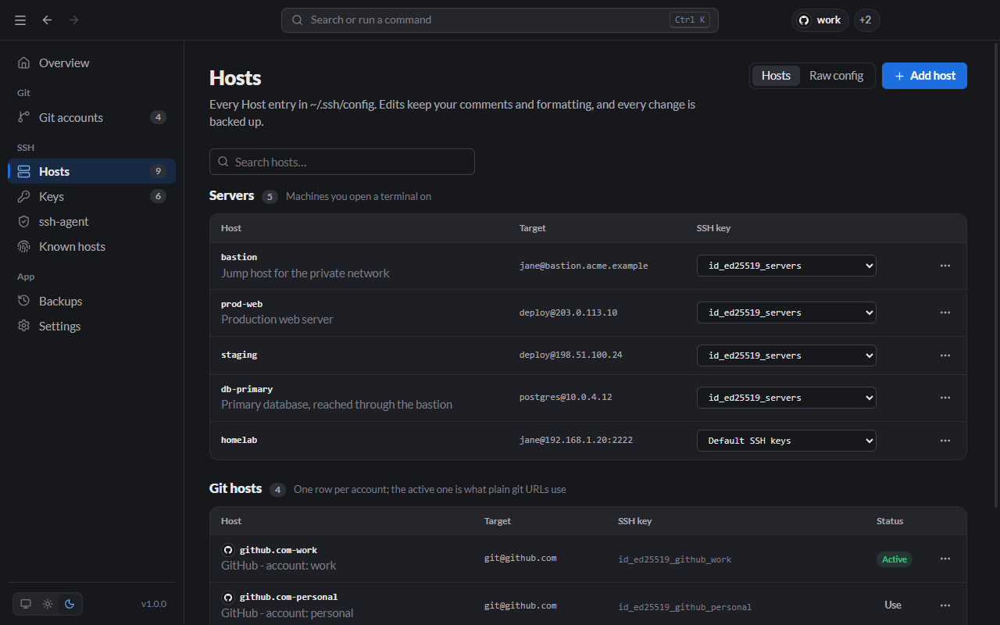
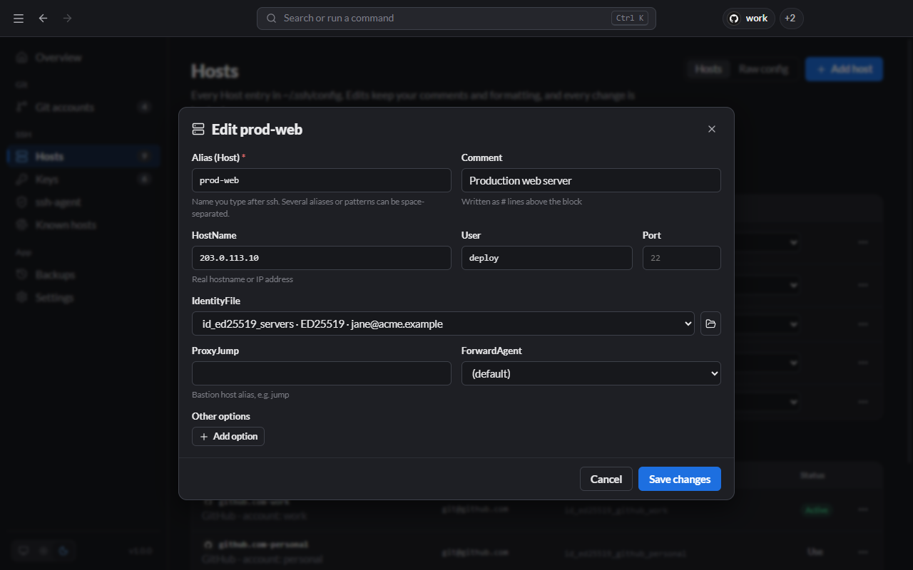
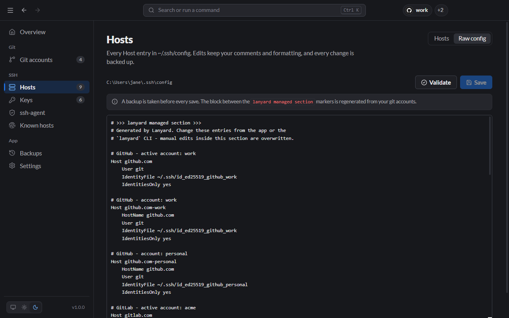

# Hosts (remote servers)

The **Hosts** page is where you manage the servers you SSH into: production and staging machines, databases behind a bastion, a home lab. Hosts already in your `~/.ssh/config` appear on their own; nothing needs importing.

It lists every `Host` entry in `~/.ssh/config`, in two groups:

- **Servers:** machines you open a terminal on.
- **Git hosts:** one row per git account, with a **Status** column showing which account is active. These are managed from [Git accounts](Git-Accounts.md).



Edits keep your comments and formatting, and every change is [backed up](Backups.md) first.

## Add or edit a server

Click **Add host** (or press <kbd>Ctrl</kbd>/<kbd>⌘</kbd>+<kbd>Shift</kbd>+<kbd>N</kbd>). To edit, open a row's **⋯** menu → **Edit**.



| Field             | Meaning                                                                          |
| ----------------- | -------------------------------------------------------------------------------- |
| **Alias (Host)**  | The name you type after `ssh`, e.g. `prod-web`. Several names can share a block. |
| **Comment**       | Written as `#` lines above the block; shown under the alias in the list.         |
| **HostName**      | The real address or IP.                                                          |
| **User / Port**   | Login user and port (22 if empty).                                               |
| **IdentityFile**  | Which key to log in with.                                                        |
| **ProxyJump**     | A jump host to go through, e.g. `bastion`.                                       |
| **ForwardAgent**  | Whether to forward your ssh-agent to the server.                                 |
| **Other options** | Any other ssh_config option, as name and value.                                  |

From the CLI:

```bash
lanyard hosts add prod-web -H 203.0.113.10 -u deploy -k ~/.ssh/id_ed25519_servers
lanyard hosts add db-primary -H 10.0.4.12 -u postgres -J bastion --comment "Primary database"
```

## Switch the key a server uses

Use the **SSH key** dropdown on the server's row. Picking a key sets `IdentityFile` and `IdentitiesOnly yes`, so SSH offers only that key. Picking **Default SSH keys** removes both again.

The same switch is in the tray (**Hosts** → server → key) and the CLI:

```bash
lanyard hosts key prod-web id_ed25519_other
lanyard hosts key prod-web --default
```

## Connect and test

Open a row's **⋯** menu:

- **Connect:** opens `ssh <alias>` in a new terminal window. Pick which terminal in [Settings](Settings.md).
- **Test login:** tries a non-interactive login and reports the result.
- **Effective config:** shows what SSH will actually use for this host after every matching block applies (`ssh -G`).

Git hosts have **Test (ssh -T)** instead of Connect, because git providers accept git commands but no shell.

## Raw config editor

Switch to **Raw config** to edit `~/.ssh/config` as text.



- **Validate** asks OpenSSH whether the text parses, without saving.
- **Save** validates first. If OpenSSH rejects the file, Lanyard shows the error and asks before saving anyway.
- The block between the `lanyard managed section` markers is regenerated from your git accounts, so edit accounts on the Git accounts page instead.
