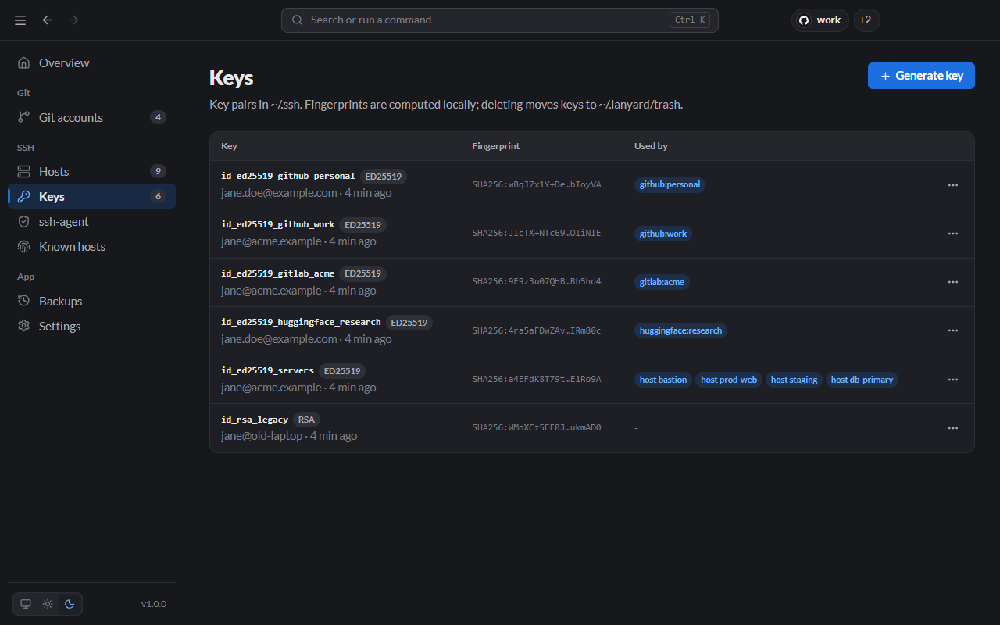
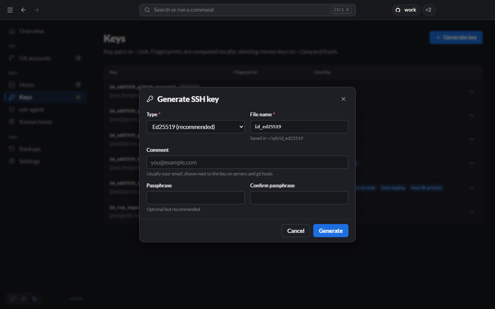

# Keys

The **Keys** page lists the key pairs in `~/.ssh`, with their type, fingerprint and what uses them.



The **Used by** column shows which git accounts and servers reference each key, so you can tell at a glance whether a key is safe to delete.

## Generate a key

Click **Generate key**.



| Field                    | What to enter                                                                                |
| ------------------------ | -------------------------------------------------------------------------------------------- |
| **Type**                 | **Ed25519** for almost everything. RSA 4096 or ECDSA only for systems that need them.        |
| **File name**            | Saved in `~/.ssh`. Lanyard warns you if the name is taken and suggests a free one.           |
| **Comment**              | Usually your email; it is shown next to the key on servers and git hosts.                    |
| **Passphrase / Confirm** | Optional but recommended. A key with a passphrase is useless to someone who copies the file. |

Keys for git accounts are generated from the [Add account](Git-Accounts.md#add-an-account) dialog instead, so they get a matching name.

From the CLI:

```bash
lanyard keys gen id_ed25519_servers -C jane@example.com
```

## Key actions

Open a key's **⋯** menu:

| Action                          | What it does                                                                                       |
| ------------------------------- | -------------------------------------------------------------------------------------------------- |
| **Show public key**             | Shows the `.pub` line with a **Copy public key** button, to paste into a server or provider.       |
| **Add to ssh-agent**            | Loads the key into the [agent](SSH-Agent.md). For a key with a passphrase, a terminal asks for it. |
| **Set / Change passphrase**     | Adds, changes or removes the passphrase. Leave the new one empty to remove it.                     |
| **Restrict permissions to you** | Makes the private key readable only by you. OpenSSH refuses keys that others can read.             |
| **Show in folder**              | Opens the folder in Explorer, Finder or your file manager.                                         |
| **Delete (move to trash)**      | Moves both files to `~/.lanyard/trash/<date>/`. Nothing is deleted permanently.                    |

To get a deleted key back, move its files from `~/.lanyard/trash/<date>/` back into `~/.ssh`.
