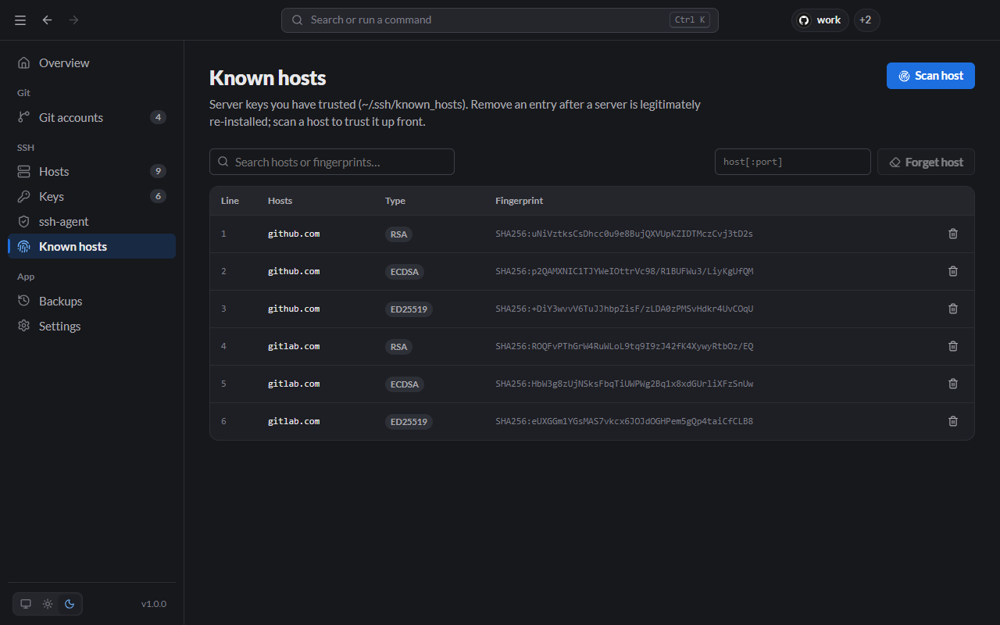
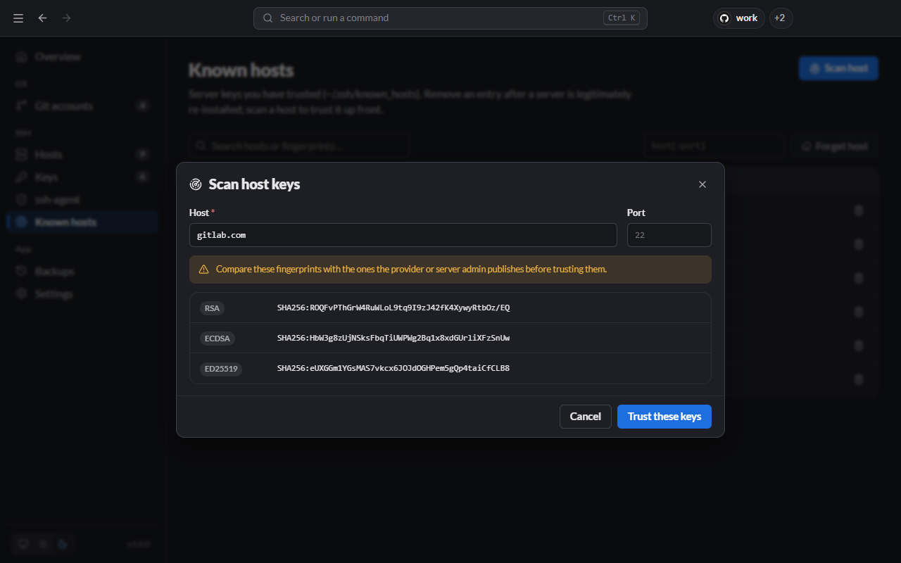

# Known hosts

`~/.ssh/known_hosts` stores the host key of every server you have trusted. SSH checks it on every connection, which is how it notices if someone is impersonating a server. The **Known hosts** page lists those entries.



## Trust a server before you connect

Click **Scan host**, enter the host name (and port if it isn't 22), and Lanyard fetches the server's host keys with `ssh-keyscan`.



**Compare the fingerprints with the ones the provider publishes before you trust them.** For example:

- GitHub: [GitHub's SSH key fingerprints](https://docs.github.com/en/authentication/keeping-your-account-and-data-secure/githubs-ssh-key-fingerprints)
- GitLab: [GitLab.com SSH host keys](https://docs.gitlab.com/user/gitlab_com/#ssh-host-keys-fingerprints)
- Your own servers: ask the administrator, or run `ssh-keygen -lf /etc/ssh/ssh_host_ed25519_key.pub` on the server.

If they match, click **Trust these keys**. From the CLI:

```bash
lanyard known-hosts scan github.com            # show fingerprints
lanyard known-hosts scan github.com --trust    # and add them
```

## "REMOTE HOST IDENTIFICATION HAS CHANGED"

SSH refuses to connect when a server's key no longer matches known_hosts. Treat that as a warning first: it is what an attack would look like.

If you know why it changed (the server was reinstalled, or the provider rotated its key and announced it):

1. Type the host in the **host[:port]** box and click **Forget host**. This removes every key for that host, including hashed entries.
2. Scan and trust it again, comparing fingerprints as above.

From the CLI: `lanyard known-hosts rm <host>`.

To remove a single line instead, use the bin icon on its row.
