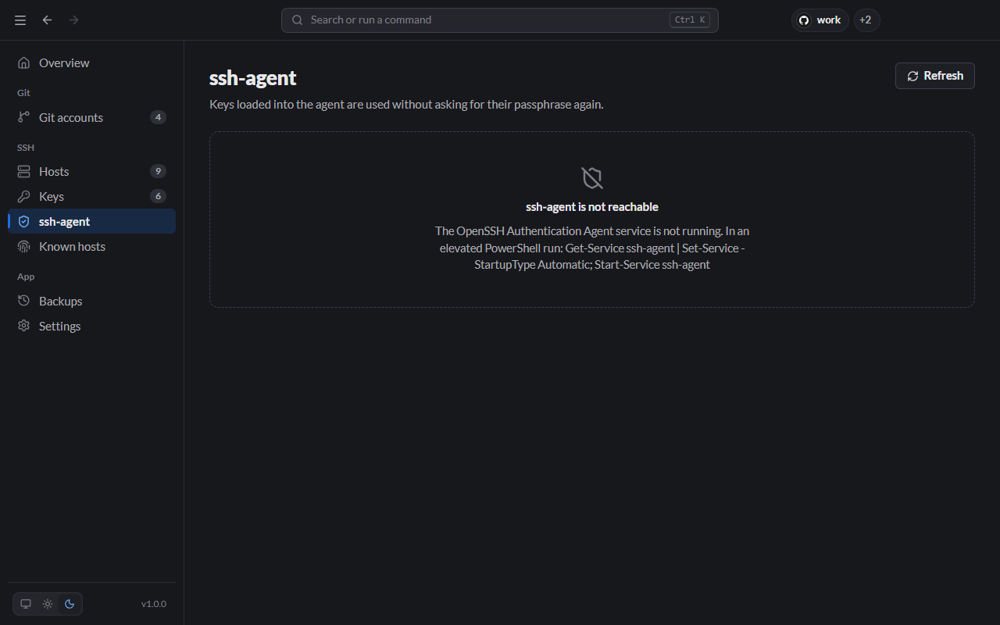

# ssh-agent

The ssh-agent keeps your keys unlocked in memory, so you type a key's passphrase once instead of on every `git push`. The **ssh-agent** page shows the keys it holds.

## Load a key

- **Keys page:** key's **⋯** menu → **Add to ssh-agent**.
- **CLI:** `lanyard agent add id_ed25519_servers`

Keys without a passphrase load straight away. For a key with a passphrase, Lanyard opens a terminal where `ssh-add` asks for it; type it there, then click **Refresh** on the ssh-agent page.

## Unload keys

- **One key:** **Remove from agent** on its row, or `lanyard agent rm <key>`.
- **All keys:** **Remove all**, or `lanyard agent clear`.

## When the agent is not running

If no agent is reachable, the page says so and shows how to start one:



**Windows.** The OpenSSH Authentication Agent is a Windows service and is disabled by default. In PowerShell **as Administrator**:

```powershell
Get-Service ssh-agent | Set-Service -StartupType Automatic
Start-Service ssh-agent
```

**macOS.** The agent starts automatically. To keep keys loaded across reboots, add this to `~/.ssh/config` (outside Lanyard's managed section):

```sshconfig
Host *
    UseKeychain yes
    AddKeysToAgent yes
```

**Linux.** Most desktops start an agent for you. In a plain shell, start one with:

```bash
eval "$(ssh-agent -s)"
```
