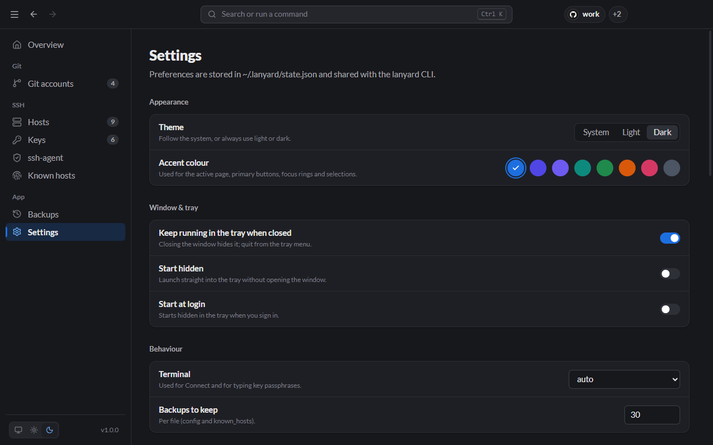
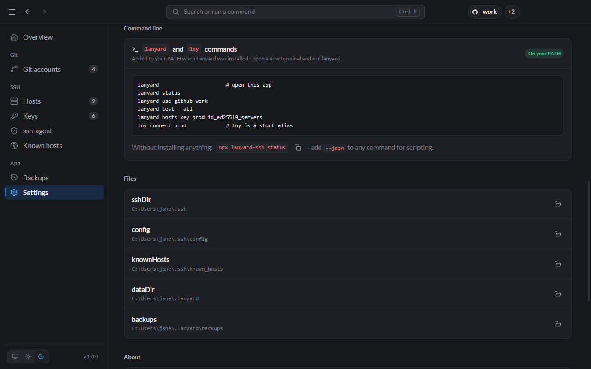

# Settings

Settings are stored in `~/.lanyard/state.json` and shared with the `lanyard` CLI.

## Appearance

- **Theme:** follow the system, or always light or dark. The three buttons at the bottom of the sidebar switch it too.
- **Accent colour:** eight colours for the active page, buttons, focus rings and selections. You can also type `accent` in the [command palette](Tray-and-Shortcuts.md#command-palette).

## Window & tray

- **Keep running in the tray when closed:** closing the window hides it; quit from the tray menu. On by default.
- **Start hidden:** launch straight into the tray.
- **Start at login:** start Lanyard, hidden in the tray, when you sign in.

## Behaviour

- **Terminal:** which terminal **Connect** and passphrase prompts open in. **auto** picks Windows Terminal if installed (else Command Prompt), Terminal on macOS, and the first terminal found on Linux.
- **Backups to keep:** how many [backups](Backups.md) of each file to keep.

## Command line, files and About

- **Command line:** whether the `lanyard` and `lny` commands are on your PATH, with examples. On macOS and Linux this shows the one-time install command.
- **Files:** every path Lanyard uses, each with a button to open it.
- **About:** version, licence, and the versions of Electron, Node.js, OpenSSH and git Lanyard found.
