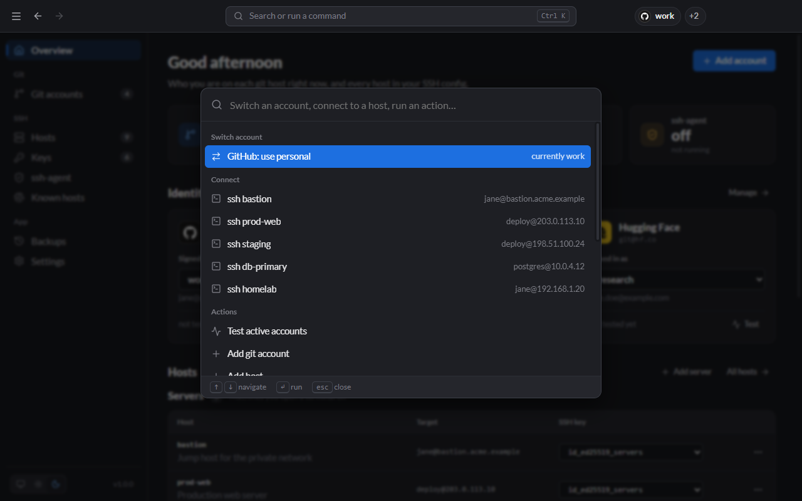

# Tray, palette and shortcuts

## System tray

Closing the window keeps Lanyard running in the system tray (the notification area on Windows, the menu bar on macOS). Right-click the icon for:

- **Open Lanyard**
- **One menu per git provider**, titled with the active account (for example **GitHub · work**). Pick another account to switch, or **None (use default SSH keys)** to deactivate.
- **Test active accounts**
- **Hosts:** your servers (connect, test, switch key) and git hosts (test, use an account).
- **Manage hosts…**, **Manage keys…**, **ssh-agent…**
- **Start at login**
- **Quit Lanyard**

The tray updates by itself when you change something in the app, the CLI, or an editor.

## Command palette

Press <kbd>Ctrl</kbd>/<kbd>⌘</kbd>+<kbd>K</kbd>, or click the search box in the top bar.

Type to filter, use <kbd>↑</kbd>/<kbd>↓</kbd> to move and <kbd>Enter</kbd> to run. It can:

- switch the active account on any provider
- connect to any server
- switch the key any server uses
- run actions: test accounts, add an account or host, generate a key, scan a host
- jump to any page
- change the theme or accent colour

## Keyboard shortcuts

<kbd>Ctrl</kbd> on Windows and Linux, <kbd>⌘</kbd> on macOS.

| Shortcut                                                   | Action                                       |
| ---------------------------------------------------------- | -------------------------------------------- |
| <kbd>Ctrl</kbd>+<kbd>K</kbd>                               | Command palette                              |
| <kbd>Ctrl</kbd>+<kbd>1</kbd> … <kbd>8</kbd>                | Go to a page, in sidebar order               |
| <kbd>Alt</kbd>+<kbd>←</kbd> / <kbd>→</kbd>                 | Back / forward                               |
| <kbd>Ctrl</kbd>+<kbd>N</kbd>                               | Add git account                              |
| <kbd>Ctrl</kbd>+<kbd>Shift</kbd>+<kbd>N</kbd>              | Add host                                     |
| <kbd>Ctrl</kbd>+<kbd>,</kbd>                               | Settings                                     |
| <kbd>Ctrl</kbd>+<kbd>+</kbd> / <kbd>-</kbd> / <kbd>0</kbd> | Zoom in / out / reset                        |
| <kbd>Ctrl</kbd>+<kbd>W</kbd>                               | Close the window (keeps running in the tray) |
| <kbd>Ctrl</kbd>+<kbd>Q</kbd>                               | Quit Lanyard                                 |

## App menu

On Windows and Linux, the **☰** button at the top left opens the app menu (File, Edit, View, Go, History, Help). **Help** has shortcuts to the SSH folder, Lanyard's data folder and Backups.
